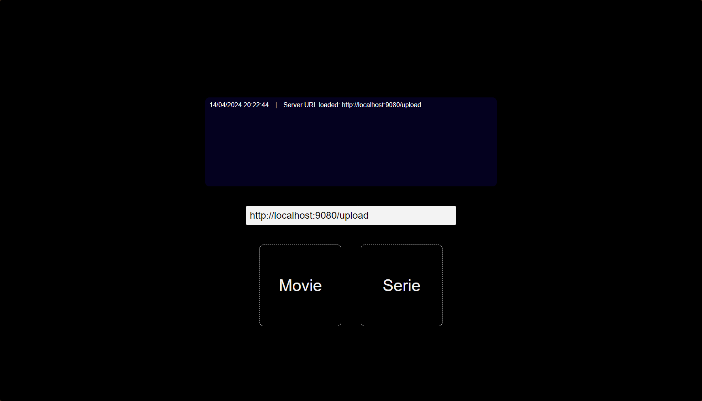
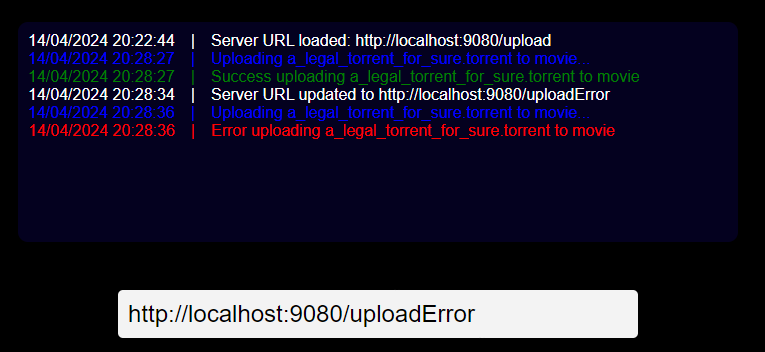
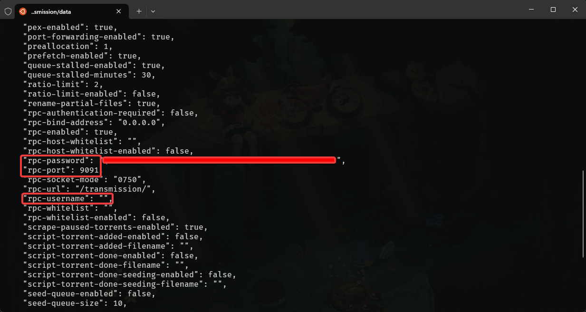

# Transmission Uploader extension

This extension allow you to drag and drop multiple torrent files at the same time to a remote Transmission server by using RPC (Remote Procedure Call).

## Components

### Extension

The extension is a simple chrome extension that show you an tab with a simple UI to upload multiple torrent files to a multiple destination directories.



You have logs to see what request is sending, and the response of the server.



### Server

The server is a simple Node.js server that receive the request from the extension and send it to the Transmission server by RPC.

## Installation

### Extension

1. Clone the repository
2. Open the Chrome browser
3. Go to `chrome://extensions/`
4. Enable the developer mode
5. Click on `Load unpacked`
6. Select the `extension` folder

### Server

1. Clone the repository
2. Go to the `server` folder
3. Run `npm install`
4. Run `node index.js`

## Configuration

### Extension

1. Open the extension
2. Change the server URL in the input
3. Nothing else

### Server

1. Go to the `server` folder
2. Change the `.env.example` file to `.env`
3. Change the variables to your configuration

```bash
TRANSMISSION_IP="localhost" # ip address of the machine running Transmission
TRANSMISSION_PORT="9091" # port of the Transmission web interface
TRANSMISSION_RPC_USERNAME="" # username for the rpc connection
TRANSMISSION_RPC_PASSWORD="" # password for the rpc connection

TORRENT_DIR='torrents' # directory where the torrents will be downloaded
```

To find your Transmission `username`, `password` and `port` for RPC connection, you will need to go in your transmission's folder and open `settings.json` file.

You will find the `rpc-username`, `rpc-password` and `rpc-port` in this file.



## Future improvements

- [ ] Add a way to change the destination directory in simple click by extension UI
- [ ] Add a estimated time to download the torrent (get info by Transmission)
